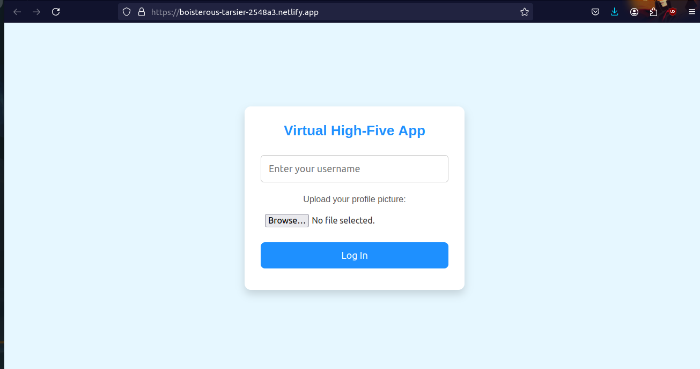
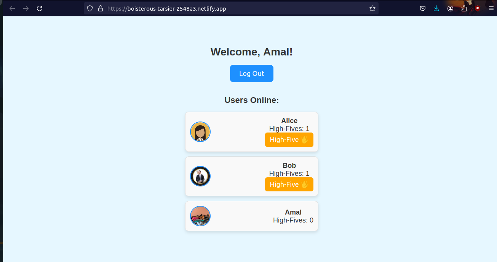
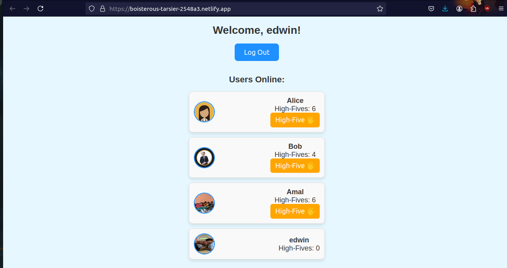

# Virtual High-Five Generator 🎉 🎯

## Basic Details
### Team Name: [Amal Mehabin's Team]

### Team Members
- Team Lead: [Amal Mehabin P] - [Cochin University Of SCience and technology]

### Project Description
[The Virtual High-Five Generator allows users to give virtual high-fives with just a click! Select a profile, click the high-five button, and hear a fun sound effect to celebrate the high-five moment.]

### The Problem (that doesn't exist)
[In a world with limited high-fives, especially in virtual spaces, how can we bridge this gap?]

### The Solution (that nobody asked for)
[Introducing the Virtual High-Five Generator: bringing that satisfying high-five to your screen! High-five virtually, hear the slap, and connect with others in a playful way.]

## Technical Details
### Technologies/Components Used
For Software:
- [Languages: HTML, CSS, JavaScript]
- [Framework: None]
- [Libraries: None]
- [Tools: netifly for hosting]

For Hardware:
- [No additional Hardware components required]

### Implementation
For Software:
# Installation
[-Clone the repository
git clone https://github.com/your-username/Virtual-High-Five-Generator.git
- cd Virtual-High-Five-Generator

 - Open index.html in your browser
open index.html
]

# Run
[The project is live on Netlify. You can access it here: (https://boisterous-tarsier-2548a3.netlify.app/)]

### Project Documentation
For Software:

# Screenshots 

*The login screen, where users enter a username and upload a profile picture.*

*The main app interface showing users online and high-five options.*

*A user giving a high-five with a sound effect to celebrate!*

# Diagrams

*Add caption explaining your workflow*

For Hardware:

# Schematic & Circuit

*Add caption explaining connections*

*Add caption explaining the schematic*

# Build Photos

*List out all components shown*

*Explain the build steps*

*Explain the final build*

### Project Demo
# Video
[Add your demo video link here]
*Explain what the video demonstrates*

# Additional Demos
[Add any extra demo materials/links]

## Team Contributions
- [Name 1]: [Specific contributions]
- [Name 2]: [Specific contributions]
- [Name 3]: [Specific contributions]

---
Made with ❤️ at TinkerHub Useless Projects 

